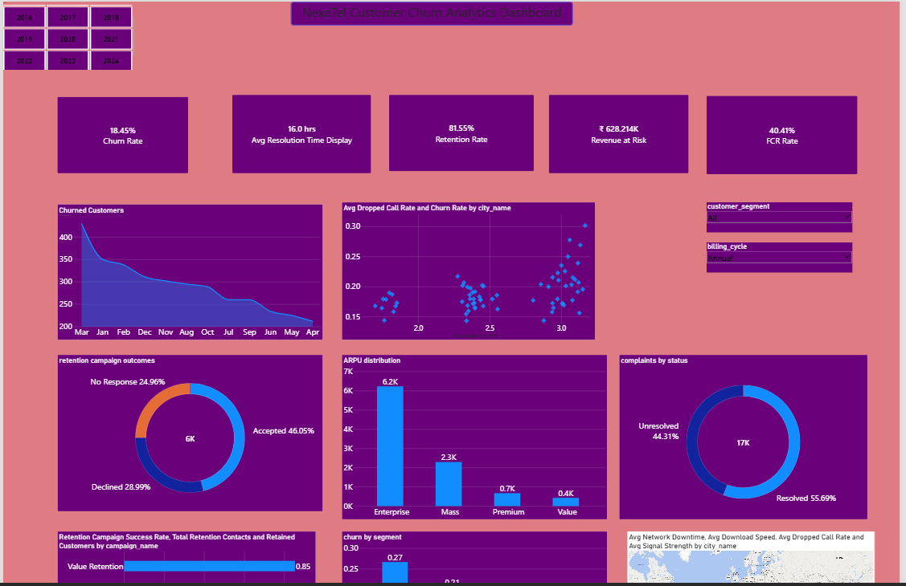

# -NexaTel-Customer-Churn-Analytics-Project

## Business Context

NexaTel Digital Services Pvt. Ltd. is a fast-growing **Indian telecom and digital-services provider** serving customers across metro, Tier-2, and Tier-3 cities throughout India. The company operates across multiple product and service lines, including **Prepaid Mobile, Postpaid Mobile, 4G, 5G, Fiber Broadband, Enterprise Connectivity, IoT Solutions, Smart Home, and OTT Bundles**.

NexaTel supports multiple payment methods, including **UPI, Credit Card, Debit Card, Net Banking, Wallet, Auto Debit, Cash, IMPS, NEFT, and RTGS**, serving customers across different segments and regions.

The company's customer and operational data consists of approximately **757,000 records across 24 interconnected tables**, covering customers, subscriptions, contracts, billing, payments, complaints, network usage, geographic information, and retention campaigns.

Over the last four quarters, NexaTel's **blended monthly churn rate increased from 1.9% to 2.7%**, while the **cost of acquiring a new subscriber increased by 22%**. This creates a growing need to understand the drivers of customer churn, identify valuable customers at risk, quantify revenue loss, and improve customer retention.

  

## Business Problem Statement

NexaTel is experiencing an increase in customer churn while customer acquisition costs are also rising. However, customer, billing, service, network, contract, complaint, and campaign information is distributed across multiple interconnected datasets, making it difficult for management to obtain a consolidated view of the factors contributing to customer attrition.

The business requires a **data-driven customer churn analytics solution** to identify which customers, plans, segments, regions, and service conditions are associated with higher churn. Management also needs to understand whether factors such as **unresolved complaints, network quality, contract renewals, customer tenure, and retention campaigns** influence customer retention.

This project addresses the problem using **Python for data cleaning, preparation, exploratory data analysis, and KPI calculations; MySQL for business-oriented analytical queries; and Power BI for interactive reporting and visualization**.

The final solution enables non-technical stakeholders to understand **who is churning, why customers are leaving, how much revenue is at risk, and where retention efforts can be focused**.

---

## Project Objectives

- Identify which **plans and customer segments** experience the highest customer churn.
- Analyze the major characteristics and potential drivers associated with **customer attrition**.
- Determine whether **unresolved and repeat complaints** are associated with higher churn.
- Identify the **most valuable customers** and determine which of them are at risk of churning.
- Analyze customer churn across **states, telecom circles, and geographic regions**.
- Investigate whether **network-quality issues and dropped calls** are associated with localized churn patterns.
- Measure the financial impact of churn by estimating **revenue lost to churn**.
- Analyze **customer tenure and contract renewal behavior** to understand customer retention.
- Evaluate the performance of **retention campaigns** and their relationship with customer retention.
- Monitor key **customer, retention, service, and revenue KPIs**.
- Develop an interactive **Power BI dashboard** to support data-driven customer retention decisions.

---

## KPI's & Metrics

- **Customer Churn Rate**  
  `Customers Lost / Customers at Start × 100`

- **Customer Retention Rate**  
  `(Customers at End - New Customers) / Customers at Start × 100`

- **Average Revenue Per User (ARPU)**  
  `Total Recurring Revenue / Average Active Subscribers`

- **Customer Lifetime Value (CLV)**  
  `ARPU × Gross Margin % × (1 / Churn Rate)`

- **Revenue Lost to Churn**  
  `Churned Customers × Their ARPU`

- **Monthly Recurring Revenue (MRR)**  
  `Sum of Active Recurring Charges`

- **First Contact Resolution (FCR)**  
  `Resolved on First Contact / Total Contacts × 100`

- **Average Resolution Time**  
  `Mean of (Resolved Time - Created Time)`

- **Contract Renewal Rate**  
  `Contracts Renewed / Contracts Due for Renewal × 100`

- **Average Customer Tenure**  
  `Mean Tenure Months of Active Customers`

---

## Stakeholders

- **Executive Leadership Team**
- **Customer Retention & Churn Management Team**
- **Customer Service & Support Team**
- **Sales & Marketing Team**
- **Finance & Revenue Management Team**
- **Network Operations Team**
- **Regional / Circle Managers**
- **Product & Plan Management Team**
- **Campaign Management Team**
- **Business Analysts & Data Analysts**
- **Non-Technical Business Managers**

---

## Data

The NexaTel Customer Churn Analytics project uses **24 interconnected CSV files** that together form the NexaTel database. The dataset contains approximately **757,000 records** and maintains referential integrity through primary and foreign key relationships.

| File | Records | Size | Description |
|---|---:|---:|---|
| `customers.csv` | 19,076 | 4.5 MB | Customer profiles, segments, plans, tenure, and churn status |
| `subscriptions.csv` | 20,523 | 1.2 MB | Active and terminated subscriptions per customer |
| `plans.csv` | 25 | 2 KB | Plan catalogue including charges, data/voice quota, and billing cycle |
| `plan_history.csv` | 19,349 | 1.1 MB | Plan upgrade and downgrade change events |
| `contracts.csv` | 10,607 | 798 KB | Contracts for postpaid, fibre, and enterprise customers |
| `devices.csv` | 19,000 | 1.5 MB | Devices assigned to customers, including handsets, routers, and IoT devices |
| `billing.csv` | 115,313 | 8.7 MB | Monthly invoices containing base charges, GST, and total amounts |
| `payments.csv` | 92,362 | 5.9 MB | Payments made against customer invoices |
| `recharges.csv` | 146,501 | 7.2 MB | Prepaid recharge transactions |
| `usage_voice.csv` | 57,000 | 2.2 MB | Monthly voice usage per customer |
| `usage_sms.csv` | 57,000 | 1.9 MB | Monthly SMS usage per customer |
| `usage_data.csv` | 57,000 | 2.1 MB | Monthly mobile data usage in GB per customer |
| `network_quality.csv` | 57,000 | 3.1 MB | Monthly network experience and quality metrics per customer |
| `support_tickets.csv` | 31,490 | 2.6 MB | Support tickets including priority, FCR, and resolution time |
| `complaints.csv` | 16,584 | 1.2 MB | Customer complaints with type, severity, and resolution status |
| `customer_feedback.csv` | 28,499 | 1.6 MB | Customer satisfaction (CSAT) and NPS survey responses |
| `retention_campaigns.csv` | 6,475 | 524 KB | Customer-level retention offers and campaign outcomes |
| `marketing_campaigns.csv` | 40 | 3.8 KB | Campaign definitions, budgets, reach, and conversions |
| `employees.csv` | 800 | 84 KB | Support and sales staff handling customer tickets |
| `stores.csv` | 2,180 | 146 KB | Retail stores by city and region |
| `regions.csv` | 4 | < 1 KB | Operating zones: North, West, South, and East |
| `cities.csv` | 68 | 3.7 KB | Cities with tier classification and PIN prefixes |
| `states.csv` | 36 | < 1 KB | Indian states and union territories |
| `data_quality_issue_log.csv` | 20 | < 1 KB | Catalogue of intentionally injected data-quality issues |

### Dataset Summary

- **Total Files:** 24 CSV files
- **Total Records:** Approximately **757,000**
- **Geographic Coverage:** India
- **Data Type:** Relational / Multi-table telecom business dataset
- **Primary Business Domain:** Customer Churn & Retention Analytics
- **Data Areas:** Customers, subscriptions, plans, contracts, billing, payments, usage, network quality, support, complaints, feedback, campaigns, and geography
- **Data Integrity:** Primary and foreign key relationships maintained across interconnected tables
- **Data Quality:** Includes intentionally injected data-quality issues for cleaning and validation exercises

## Project Workflow

The project follows an end-to-end customer churn analytics workflow that transforms raw telecom data into actionable business insights.

### 1. Data Cleaning & Preparation

- Loaded and examined the NexaTel datasets using **Python and Pandas**.
- Analyzed dataset structures, columns, data types, and record counts.
- Handled missing values and duplicate records.
- Standardized inconsistent formats and data types.
- Converted and validated date-related fields.
- Performed data-quality and consistency checks.
- Prepared analysis-ready datasets for downstream analytics.

### 2. Business Analysis Using MySQL

- Loaded the prepared datasets into **MySQL**.
- Joined related customer, subscription, billing, contract, complaint, network, and geographic tables.
- Developed SQL queries to answer key business questions.
- Analyzed churn across customer segments, plans, regions, contracts, complaints, and service conditions.
- Investigated customer behavior and operational factors associated with churn.
- Generated business insights for further analysis and reporting.

### 3. Exploratory Data Analysis

- Performed **EDA using Python**.
- Analyzed customer distributions and churn patterns.
- Examined relationships between customer characteristics and churn.
- Investigated churn across plans, segments, tenure groups, regions, and service conditions.
- Analyzed complaints, contract renewals, network performance, and customer behavior.
- Identified trends, patterns, anomalies, and potential churn drivers.

### 4. KPI Calculations

- Calculated key business and customer-retention metrics using **Python**.
- Calculated **Customer Churn Rate** and **Customer Retention Rate**.
- Calculated **ARPU** and **Monthly Recurring Revenue (MRR)**.
- Estimated **Customer Lifetime Value (CLV)**.
- Quantified **Revenue Lost to Churn**.
- Calculated **First Contact Resolution (FCR)**.
- Calculated **Average Resolution Time**.
- Measured **Contract Renewal Rate**.
- Calculated **Average Customer Tenure**.

### 5. Power BI Dashboard

- Connected the prepared analytical data to **Power BI**.
- Developed an interactive customer churn analytics dashboard.
- Created KPI cards for churn, retention, revenue, customer service, and contract performance.
- Visualized churn by **customer segment, plan, tenure, state, circle, and region**.
- Analyzed **customer complaints and support performance**.
- Visualized **network-quality indicators and regional churn patterns**.
- Analyzed **retention campaign outcomes and revenue trends**.
- Added interactive filters and slicers for business-level analysis.
- Consolidated the analysis into an executive-friendly dashboard for **data-driven customer retention decisions**.

### Dashboard Preview

  

